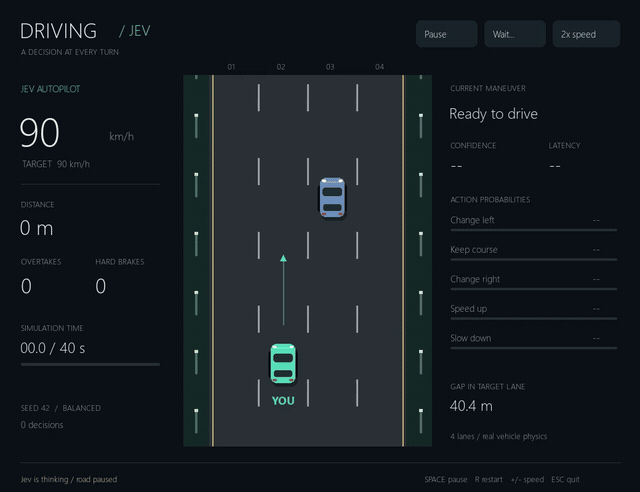
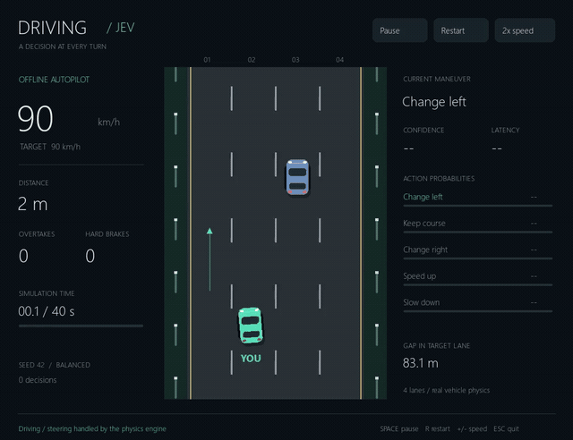

# Driving / Jev

Jev가 고속도로 교통 상황을 보고 차선 변경과 가감속을 선택하는 자동 운전 게임입니다.
앞차를 따라갈지, 옆 차선으로 추월할지, 감속할지 판단하는 과정을 화면에서 볼 수 있습니다.

## 플레이 영상

같은 시작 교통 상황(시드 42)에서 40초 동안 주행합니다. 두 영상 모두 게임 속도는 2배이며,
Jev 영상에는 실제 API 응답을 기다리는 시간도 포함되어 있습니다.
GIF를 클릭하면 전체 MP4 영상을 볼 수 있습니다.

| Jev · 실제 API 판단 | 오프라인 · 규칙 기반 판단 |
| --- | --- |
| [](media/jev.mp4) | [](media/offline.mp4) |
| [전체 동영상](media/jev.mp4) · [화면 이미지](media/jev.png) | [전체 동영상](media/offline.mp4) · [화면 이미지](media/offline.png) |

## 실행

Python 3.13 이상이 필요합니다. 이 폴더에서 가상환경과 의존성을 준비합니다.

```powershell
uv venv --python 3.13 .venv
uv pip install --python .venv\Scripts\python.exe -e ".[dev]"
Copy-Item .env.example .env # 최초 설정에만 실행
```

`.env`에 `TYPESAFE_API_KEY=실제키`를 입력합니다. 키는 프로젝트 디렉터리에서
읽으며, 이미 설정된 환경변수가 있으면 그 값을 우선합니다.

- **play.cmd**: Jev API 자동 운전
- **play-offline.cmd**: API 없는 규칙 기반 자동 운전
- **Space**: 일시정지·재개, **R**: 같은 교통 상황으로 재시작
- **+/-**: 표시 속도 1·2·4배 순환, **Esc/Q**: 종료

```powershell
.\.venv\Scripts\driving-jev.exe
.\.venv\Scripts\driving-jev.exe --policy heuristic
.\.venv\Scripts\driving-jev.exe --style cautious
.\.venv\Scripts\driving-jev.exe --seed 123 --duration 60
```

`--paused`를 붙이면 API 요청 없이 일시정지 상태로 창을 엽니다.
기본 한 판은 **시뮬레이션 40초, 최대 40회 판단**입니다. 충돌하거나 도로를 벗어나면
조기 종료합니다. 창은 결과를 표시한 채 유지되며, 재시작은 새 판의 호출 한도를 사용합니다.
API 요청은 제공자의 일반 사용 요금에 포함됩니다. 자동 재시도는 하지 않습니다.

## 화면에서 볼 수 있는 것

- 현재 속도와 목표 속도
- 이동 거리, 추월한 차량 수, 급감속 횟수
- 현재 선택한 행동과 행동별 확률, 모델 확신도, 응답 시간
- 목표 차선의 앞차와 간격
- 남은 시뮬레이션 시간과 판단 횟수

초록색 차가 Jev가 조작하는 차량입니다. 화면 위쪽으로 달리며, 차선 번호는 왼쪽부터
1~4입니다. 오프라인 모드에서는 모델 확률·확신도·API 지연을 표시하지 않습니다.

## Jev와 게임 엔진의 역할

차량 물리와 다른 차량의 행동에는 [HighwayEnv](https://highway-env.farama.org/)를 사용합니다.
화면은 Pygame으로 별도로 그립니다. 세로 도로 화면은 실제 시뮬레이션 좌표를 변환한
표현이며, 가로와 세로의 표시 축척은 다릅니다.

1. 코드가 시뮬레이터에서 내 차의 속도와 차선, 차선별 앞뒤 차량의 간격·속도·접근 시간을 추출합니다.
2. 차간 시간과 3초 뒤 예상 앞차 간격, 차선별 공간·앞차 속도 차이를 계산해 행동별 비교 정보로 제공합니다.
3. Jev의 `Choice`가 **왼쪽 차선 / 유지 / 오른쪽 차선 / 가속 / 감속** 중 하나를 선택합니다.
4. HighwayEnv의 제어기가 목표 차선과 속도를 따라 부드럽게 조향하고 가감속합니다.
5. 시뮬레이션 1초가 진행되면 다음 판단을 요청합니다.

**API 응답을 기다릴 때는 도로가 멈춥니다.** 화면만 계속 갱신하므로 네트워크 지연이
차량을 의도치 않게 전진시키지 않습니다. 일시정지 중 이미 시작된 요청 하나는 완료될 수 있지만,
새 요청은 보내지 않고 물리도 진행하지 않습니다. 오류가 나면 일시정지하고 Retry로 다시 시도합니다.

화면을 이미지로 모델에 보내지 않으며, 모델이 핸들 각도를 매 프레임 조작하지도 않습니다.
코드는 도로 끝이나 속도 한계에 따른 불가능한 행동, 진행 중인 차선 변경의 중복 명령만 제외합니다.
위험한 결정을 안전한 결정으로 몰래 바꾸는 제어기는 없습니다.

교통 관측 범위는 앞뒤 150m입니다. 충돌 예상 시간은 현재 속도 차이에 기반한 추정으로,
다른 차량의 차선 변경이나 가속을 완벽하게 예측하지 않습니다. 충돌이 없는 주행을 보장하지 않습니다.
이 프로젝트는 게임·판단 시각화 데모이며 실제 차량 제어용이 아닙니다.

## 오프라인 비교

오프라인 운전자는 앞차가 느리면 옆 차선의 앞뒤 간격을 검사해 추월하거나 감속합니다.
도로가 비면 목표 속도까지 가속합니다. `balanced`는 최대 108km/h,
`cautious`는 90km/h를 목표로 하는 판단 기준입니다.

같은 시드를 쓰면 시작 교통 상황은 같습니다. 이후 다른 차량들이 내 차의 움직임에
반응하므로, 두 정책의 후속 교통 상황까지 동일하게 유지되는 것은 아닙니다.

```powershell
.\.venv\Scripts\driving-jev.exe --headless --policy heuristic --seed 42 --duration 40
.\.venv\Scripts\driving-jev.exe --headless --policy jev --seed 42 --duration 40
```

추월 횟수는 시작할 때 앞에 있던 차량을 완전히 지나간 횟수이며, 같은 차량은 한 번만 셉니다.
급감속은 가속도가 -4m/s² 아래로 내려가는 시점마다 한 번 셉니다.
반복 실행해도 모델 가중치를 학습하지는 않습니다.

## 개발

```powershell
.\.venv\Scripts\python.exe -m pytest -q
.\.venv\Scripts\ruff.exe check src tests
.\.venv\Scripts\ruff.exe format --check src tests
```

- `engine.py`: 차량 물리 연결, 차선별 관측, 주행 지표
- `policy.py`: Jev 호출과 규칙 기반 운전자
- `app.py`: 게임 화면, 비동기 판단, 일시정지·재시작, 실행 로그

`artifacts/`의 JSONL에는 시드, 환경 설정, 판단 전 상태, 실제 선택, 1초 주행 후 상태와
종료 원인을 기록합니다. Jev 판단에는 모델에 전달한 행동별 비교 정보(`assessment`)와 기준 버전도 포함됩니다. `.env`와 가상환경, 실행 로그는 Git에서 제외됩니다.
